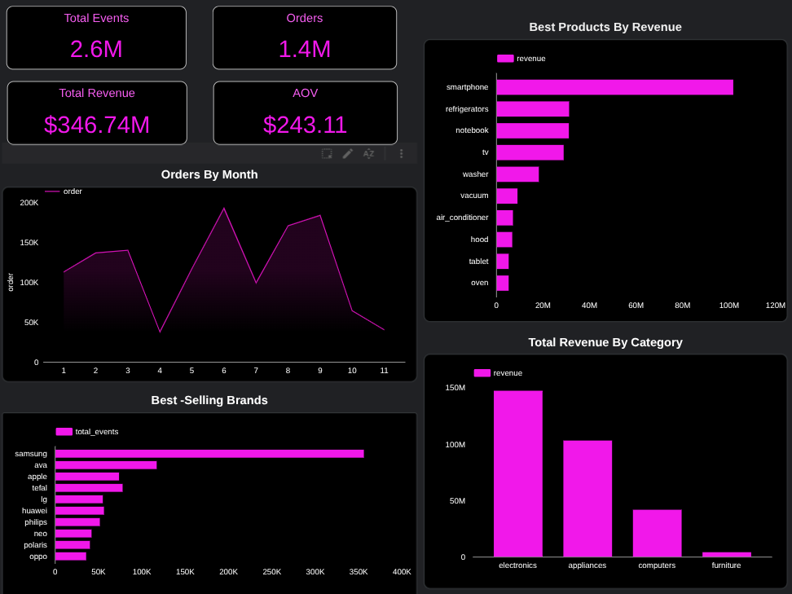

# E-Commerce Purchase History Analysis

##  Project Overview

This project analyzes 2020 transactional data from a major e-commerce retailer to identify revenue drivers, top-performing brands and categories, and seasonal sales patterns. Using Python for data preprocessing and feature engineering, the analysis uncovers actionable insights that are presented through interactive Looker Studio dashboards to support strategic business decisions.

##  Objectives

- Identify revenue and total sales trends

- Explore best-selling brands, categories, and products

- Analyze seasonal sales patterns

- Build an interactive dashboard to visualize and communicate key insights

## 🗂️ Dataset

- **Source**: Kaggle - E-Commerce Purchase History from Electronics Store (Kazakhstan market)
- **Time Period**: 2020 only
- **Total Records**: 2,633,521
- **Market**: Electronics retail

### Dataset Features

    Column              Description 

 `event_time`        Timestamp of the transaction 
 
 `order_id`          Unique order identifier 
 
 `product_id`        Unique product identifier 
 
 `category_id`       Product category ID 

 `category_code`     Product category code 
 
 `brand`             Product brand name 
 
 `price`             Product price (currency units) 
 
 `user_id`           User identifier 

##  Data Workflow

### Data Loading

- Imported CSV data using Pandas.

### 1. Data Cleaning

- Removed duplicate records to ensure data integrity.
- Handled missing values by correcting inconsistent entries in columns such as price and user_id, and filling missing values with 'Unknown' in columns like brand and category_code.
- Extracted year, month, and day from the event_time column to facilitate temporal analysis.
- Processed multi-value categorical columns by splitting them into separate entries for easier analysis.

### 2. Data Analysis

- Examined the most in-demand items, categories, and brands.
- Analyzed seasonal sales patterns to identify trends.
- Grouped data by relevant dimensions and calculated summary statistics, including total revenue and total sales.
- Explored the highest revenue generated by each category, brand, and product.
- Explored the Average Order Value.

### 3. Aggregation

- Created tables to compare monthly performance and analyze seasonal trends.
- Created tables to identify best-selling and highest-revenue products, brands, and categories.
- Combined temporal and categorical to provide multidimensional insights.l breakdown

### 4. Data Visualization

Built an interactive Looker Studio dashboard to visualize:

- Total revenue, total sales, total number of orders and Average Order Value(AOV)
- Revenue by top-selling products
- Distribution of revenue across the months of 2020
- Top-performing categories and brands

### 📊 Dashboard Preview

## 🌐 Live Dashboard
[View Interactive Dashboard](https://lookerstudio.google.com/reporting/18d2ead4-162d-44c7-b666-686781e4ce11)

## 🔎 Key Insights

- Total Revenue: $350.6M USD
- Average Order Value (AOV): $243.11
- Average Products per Order: ~1.8 items
- Busiest Month: August 2020 (highest number of orders)
- Top Brand: Samsung – 326K sales, $88M revenue
- Premium Products: Electronics segment shows higher price points and revenue contribution
- Top-Selling Product: Smartphone – 345.4K units sold, $101.9M revenue

**Purpose**: Business Intelligence & Data Visualization

## 🛠️ Tools Used

Python (Pandas, NumPy, Matplotlib, Seaborn)
Looker Studio
Git & GitHub
## 📂 Project Structure

E-commerce-sales-analysis-2020/
│

├── data/                  # Cleaned dataset (excluded from GitHub)

├── e-commerce_analysis.ipynb

├── looker_studio_data/    # Aggregated tables for dashboard

├── dashboard/             # Dashboard screenshot

├── requirements.txt

└── README.md

## 👤 Author
Abdelhak Morhlia

